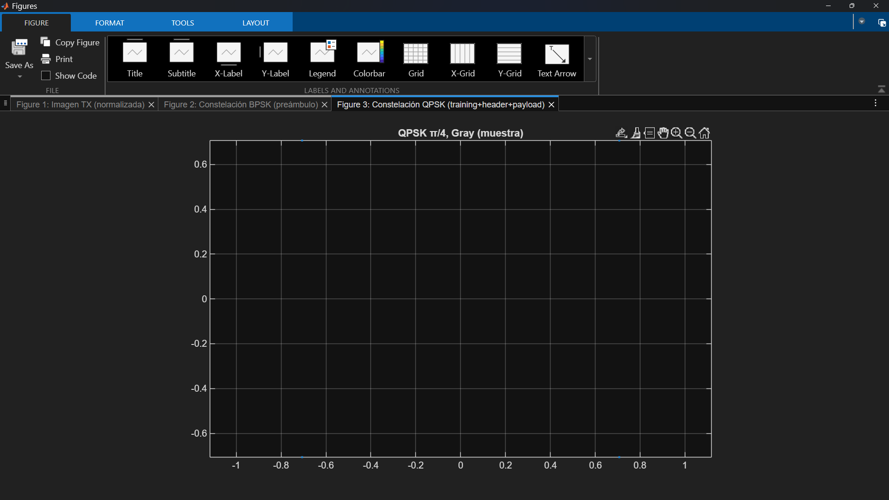
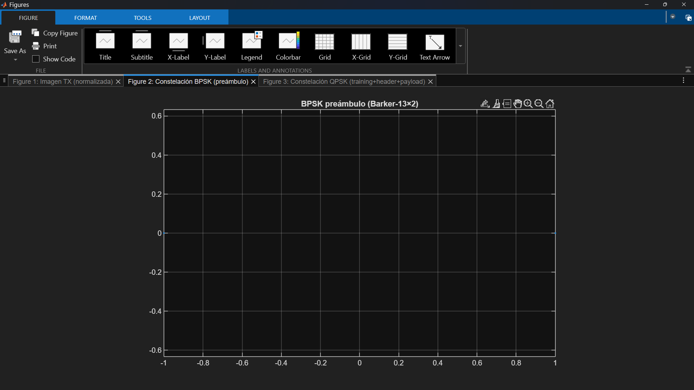
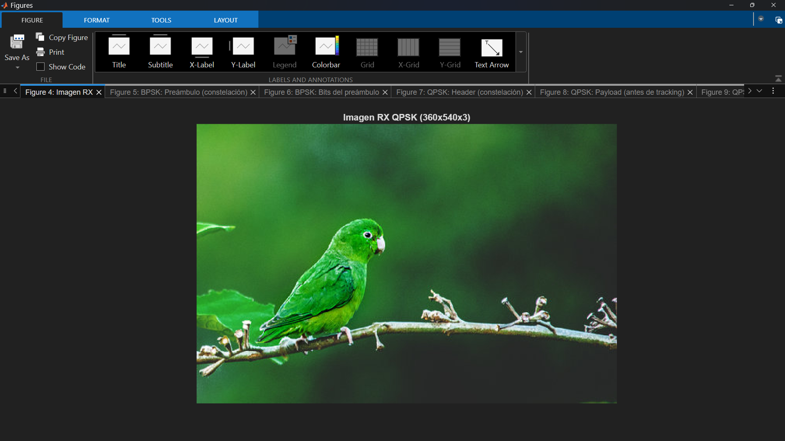
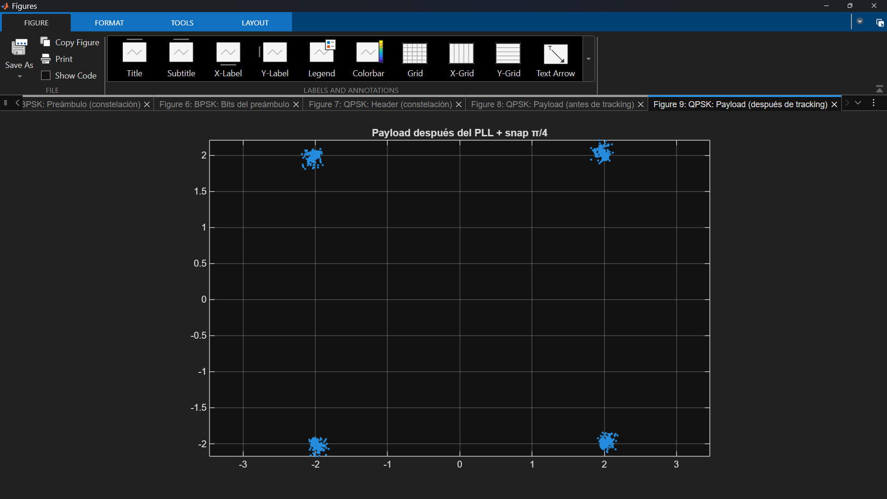
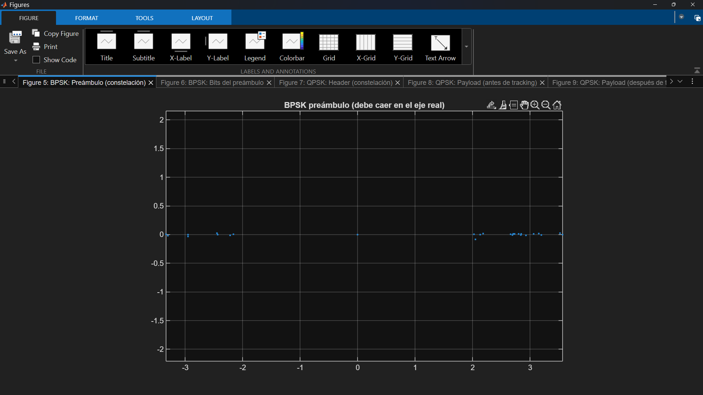

# Transmisión y recepción de imágenes con QPSK

Este proyecto implementa un enlace digital completo de **transmisión y recepción de imágenes** usando:

- **Modulación QPSK con offset π/4 y mapeo Gray**
- **Filtrado Raised Cosine (RRC)** en transmisión y recepción
- **Sincronización automática en el receptor** (timing, frecuencia y fase)
- Reconstrucción de la imagen **solo a partir de muestras I/Q** almacenadas en un archivo `.sc16q11`

- Lenguaje: **MATLAB**
- Dominio: **Comunicaciones digitales / SDR**
- Scripts principales:
  - Transmisor: `tx_img_qpsk_simple.m`
  - Receptor: `rx_img_qpsk_simple.m`

En resumen: se toma una imagen (`.jpg/.jpeg/.png`), se construye un frame QPSK robusto, se genera un archivo de muestras complejas (`.sc16q11`), y en el receptor se recupera la imagen únicamente a partir de esas muestras I/Q.

---

## 1. Descripción general del flujo

Cadena completa TX/RX (banda base compleja):

    Imagen → Bits → Scrambler → Frame QPSK (PRE + TRAIN + HEADER + PAYLOAD)
          → Filtro RRC TX → Archivo IQ (.sc16q11)
          → (canal / SDR)
          → IQ recibido → Filtro RRC RX → Symbol Sync
          → Detección Barker → Estimación CFO / fase
          → Training QPSK → Búsqueda HEADER (rotación / slip + CRC)
          → PLL QPSK → Descrambler → Reconstrucción de imagen
---

## 2. Características principales

- **Modulación**
  - QPSK con **offset π/4**.
  - Mapeo **Gray** (2 bits por símbolo).

- **Framing robusto**
  - Preambulo **Barker BPSK 13×2** para detectar el inicio del frame.
  - **64 símbolos de entrenamiento QPSK** para refinar frecuencia y fase.
  - **HEADER auto‐descriptivo** con alto, ancho y número de canales de la imagen.
  - **CRC16 (CRC-16-IBM, poly 0xA001)** para validar el HEADER.

- **Scrambler / descrambler**
  - LFSR de **7 bits**, polinomio `1 + x⁴ + x⁷`, semilla 127.
  - Dispersa patrones repetitivos de la imagen en el dominio de bits.

- **Filtrado RRC**
  - 8 muestras por símbolo (`sps = 8`).
  - Factor de rolloff `0.35`.
  - Span de `10` símbolos.
  - Implementado con:
    - `comm.RaisedCosineTransmitFilter`
    - `comm.RaisedCosineReceiveFilter`

- **Sincronización en el receptor**
  - Recuperación de **timing** con `comm.SymbolSynchronizer` (Zero-Crossing, decision-directed).
  - Estimación inicial de **CFO** y fase usando el preámbulo Barker (ajuste de recta a la fase).
  - Refinamiento con la secuencia de **training QPSK** (probando conjugado / no conjugado y quedándose con la menor varianza de error de fase).
  - Búsqueda del HEADER explorando rotaciones (0, 90, 180, 270 grados) y slips de bit (0–3).
  - PLL QPSK con `comm.CarrierSynchronizer` y corrección de ambigüedad de fase mediante la estadística de potencia cuatro (`s^4`) y snap a π/4.

---

## 3. Estructura del frame

Frame transmitido a 1 símbolo por muestra (antes del filtro RRC):

    [ PREÁMBULO BPSK ] + [ TRAINING QPSK (64 símbolos) ] + [ HEADER QPSK ] + [ PAYLOAD QPSK ]

- **PREÁMBULO BPSK**
  - Secuencia Barker de longitud 13, repetida 2 veces → 26 símbolos BPSK.
  - Se usa para localizar de forma robusta el inicio del frame y estimar CFO/fase inicial.

- **TRAINING QPSK**
  - 64 símbolos QPSK conocidos.
  - Permiten refinar la estimación de frecuencia y fase después del preámbulo.
  - Se evalúa también la opción conjugada para resolver inversiones de espectro.

- **HEADER (56 bits)**
  - Alto `H`     → 16 bits (MSB-first).
  - Ancho `W`    → 16 bits (MSB-first).
  - Canales `C`  →  8 bits (1 = gris, 3 = RGB).
  - CRC16 sobre `[H W C]` → 16 bits adicionales (CRC-16-IBM, poly 0xA001).
  - El receptor acepta solo headers con:
    - 1 ≤ H, W ≤ 8192
    - C ∈ {1, 3}
    - CRC válido.

- **PAYLOAD**
  - Bytes de la imagen → bits (MSB-first).
  - Se aplican al scrambler LFSR de 7 bits (`1 + x⁴ + x⁷`, semilla 127).
  - Mapeo a símbolos QPSK (2 bits por símbolo, offset π/4, Gray).

---

## 4. Flujo de transmisión (`tx_img_qpsk_simple.m`)

1. **Lectura y normalización de la imagen**
   - Entrada: ruta de imagen (`.jpg`, `.jpeg` o `.png`).
   - Convierte imágenes indexadas y RGBA a RGB cuando es necesario.
   - Aplica orientación EXIF si existe.
   - Salida: matriz `uint8` con dimensiones `H × W × C` (C = 1 o 3).

2. **Construcción del HEADER**
   - Empaqueta `H`, `W`, `C` en 40 bits (MSB-first).
   - Calcula **CRC16** sobre esos 40 bits y genera 16 bits adicionales.
   - HEADER total: 56 bits → se mapeará luego a QPSK.

3. **Scrambler del PAYLOAD**
   - Convierte todos los bytes de la imagen a bits (MSB-first).
   - Aplica scrambler LFSR de 7 bits con polinomio `1 + x⁴ + x⁷` y semilla 127.
   - Genera la secuencia de bits que se usará como payload.

4. **Construcción del frame en símbolos**
   - Preambulo BPSK: Barker 13×2.
   - Training QPSK: 64 símbolos conocidos (patrón fijo).
   - HEADER QPSK (56 bits → 2 bits/símbolo).
   - PAYLOAD QPSK (bits scrambled → 2 bits/símbolo).
   - Modulación QPSK con offset π/4 y Gray mediante `pskmod`.

5. **Filtrado RRC y normalización**
   - Filtro TX: `comm.RaisedCosineTransmitFilter` con:
     - `OutputSamplesPerSymbol = 8`
     - `RolloffFactor = 0.35`
     - `FilterSpanInSymbols = 10`
   - Se añade cola de ceros para vaciar el filtro.
   - Se normaliza la señal compleja para aprovechar el rango dinámico.

6. **Exportación a archivo IQ**
   - La señal filtrada se guarda como `sc16q11` mediante `save_sc16q11()`.
   - El script imprime por consola:
     - Dimensiones de la imagen.
     - Bytes / bits del payload.
     - Símbolos en cada sección (PRE / TRN / HDR / PAY).
     - Número total de muestras.

**Figura 1. Imagen original a transmitir**
    

**Figura 2. Constelación de la imagen**
    

**Figura 3. Constelación del preámbulo**
    

---

## 5. Flujo de recepción (`rx_img_qpsk_simple.m`)

1. **Carga y preprocesado**
   - Lectura del archivo `.sc16q11` con `load_sc16q11()`.
   - Conversión a `double`.
   - Eliminación de componente DC.
   - Normalización de amplitud (RMS ≈ 1).

2. **Filtro RRC RX**
   - `comm.RaisedCosineReceiveFilter` con:
     - `InputSamplesPerSymbol = 8`
     - `DecimationFactor = 1`
     - `RolloffFactor = 0.35`
     - `FilterSpanInSymbols = 10`
   - Se descarta la cola del filtro para alinear el frame.

3. **Recuperación de timing**
   - `comm.SymbolSynchronizer` con detector:
     - `Zero-Crossing (decision-directed)`
     - `SamplesPerSymbol = 8`
     - `DampingFactor = 1.0`
     - `NormalizedLoopBandwidth ≈ 0.006`
   - Salida: señal a **1 símbolo por muestra**.

4. **Detección del preámbulo Barker**
   - Se genera el mismo Barker BPSK 13×2.
   - Se realiza una correlación compleja con la señal recibida.
   - El máximo de la correlación da el índice de inicio del preámbulo.
   - A partir de ahí se define el origen del frame.

5. **Estimación inicial de CFO / fase (preámbulo BPSK)**
   - Se multiplica el preámbulo recibido por el conjugado del preámbulo ideal.
   - Se toma la fase, se desenrolla (unwrap) y se ajusta una recta (polyfit).
   - Pendiente → estimación de frecuencia (CFO).
   - Ordenada → fase estática.
   - Se corrige toda la señal a partir de ese punto.

6. **Refinamiento con training QPSK**
   - Se toma el segmento correspondiente a los 64 símbolos QPSK de training.
   - Se prueban dos opciones:
     - Señal normal.
     - Señal conjugada.
   - En cada caso se calcula la fase respecto a los símbolos ideales y se ajusta una recta.
   - Se escoge la opción con **menor varianza de error de fase**.
   - Se corrige de nuevo el resto de la señal con la estimación refinada.

7. **Búsqueda del HEADER (rotación / slip + CRC)**
   - Sobre una ventana inicial de símbolos se exploran:
     - Rotaciones de fase: 0, 90, 180, 270 grados.
     - Slips de bit: 0, 1, 2, 3 (desfase de agrupación de bits).
   - Para cada combinación:
     - Se demodula en QPSK Gray.
     - Se leen los primeros 56 bits como HEADER.
     - Se reconstruyen `H`, `W`, `C`.
     - Se calcula el CRC16 sobre los 40 bits de datos y se compara.
   - Se acepta la combinación que produce un HEADER válido:
     - Rango de H y W razonable.
     - C ∈ {1, 3}.
     - CRC correcto.
   - Se fijan:
     - Si la señal se conjugó o no.
     - Rotación de fase final.
     - Slip de bits.

8. **PLL QPSK y corrección fina de fase**
   - El payload pasa por `comm.CarrierSynchronizer` configurado para QPSK.
   - Se usa la estadística de potencia 4 (`s^4`) para medir la fase media del conjunto y corregir la ambigüedad de π/2.
   - Se ajusta un pequeño error residual y se alinea con el offset π/4 del transmisor.

9. **Demodulación, descrambler y reconstrucción de la imagen**
   - Se demodula en QPSK Gray (HEADER + PAYLOAD).
   - Se descartan los bits del HEADER (ya procesados).
   - Se aplica el **descrambler LFSR de 7 bits** con la misma semilla.
   - Se calculan los bits necesarios:
     - `needBytes = H × W × C`
     - `needBits  = needBytes × 8`
   - Se recorta o rellena con ceros si hace falta.
   - Se agrupan en bytes y se hace `reshape` a:
     - `H × W` si C = 1 (imagen en gris).
     - `H × W × 3` si C = 3 (RGB).
   - Se muestra la imagen reconstruida.

Lugar sugerido para ejemplo de imagen recibida y constelaciones:

   
  <b>Figura 1.</b> Imagen reconstruida en el receptor QPSK.

   
  <b>Figura 2.</b> Constelación BPSK asociada al preámbulo de sincronización.

   
  <b>Figura 3.</b> Constelación QPSK del enlace (training + datos de imagen).

---

## 6. Requisitos

- **MATLAB**
  - Probado con versiones recientes.
- Toolboxes:
  - Communications System Toolbox (por uso de objetos `comm.*`).
- Funciones auxiliares (no incluidas aquí):
  - `save_sc16q11.m` → guardar I/Q en formato `.sc16q11` (int16 + escala Q11).
  - `load_sc16q11.m` → cargar I/Q desde `.sc16q11`.

Opcional:

- Hardware SDR (por ejemplo, bladeRF) para transmitir los archivos `.sc16q11` por radio real.

---

## 7. Cómo usar

### Transmisor

Ejemplo básico:

    % Transmitir una imagen y generar archivo IQ
    tx_img_qpsk_simple('ejemplos/foto.png', 'tx_foto.sc16q11');

Si no se pasan argumentos, el script pide la ruta de la imagen por teclado y guarda por defecto en `transmision_qpsk.sc16q11`.

### Receptor

Ejemplo básico:

    % Reconstruir la imagen a partir del archivo IQ
    img_rx = rx_img_qpsk_simple('tx_foto.sc16q11');

    % (Opcional) volver a mostrarla
    figure; imshow(img_rx);
    title('Imagen reconstruida en RX');

---

## 8. Qué demuestra este proyecto

Este repositorio muestra experiencia práctica en:

- **Modulación digital**:
  - QPSK con offset π/4.
  - Mapeo Gray y manejo de ambigüedades de fase.

- **Conformación de pulsos y filtrado**:
  - Raised Cosine Root (RRC) TX/RX con parámetros realistas (sps = 8, rolloff = 0.35, span = 10).

- **Diseño de framing robusto**:
  - Preambulo Barker para detección fiable de inicio de trama.
  - Secuencia de entrenamiento QPSK para estimación de canal / sincronización fina.
  - HEADER auto contenido con dimensiones de la imagen y tipo de canales.
  - Verificación de integridad con CRC16.

- **Sincronización en receptor**:
  - Recuperación de reloj de símbolos (Symbol Synchronizer).
  - Estimación de CFO y fase a partir de secuencias piloto.
  - Manejo de conjugación y rotaciones de constelación.
  - PLL QPSK en lazo cerrado para corrección fina.

- **Procesado de IQ para SDR**:
  - Exportación e importación de archivos `.sc16q11`.
  - Pipeline listo para conectar con hardware SDR (bladeRF u otros).

En conjunto, es un ejemplo compacto pero completo de un **enlace de comunicaciones digitales** (TX+RX) orientado a transmisión de imágenes en banda base compleja.
